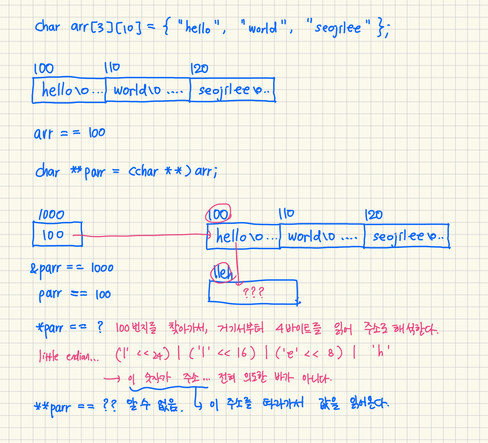

# C언어(2) 소모임 - 정기 (12주차)
> - [포인터의 배열](#포인터의-배열)
> - [배열의 포인터](#배열의-포인터)
## 포인터의 배열
```c
// arr는 char를 저장하는 2차원 배열, arrp는 char의 주소를 저장하는 1차원 배열.
// => arr는 char 변수의 배열, arrp는 char 포인터변수의 배열.
char arr[3][10] = { "hello", "world", "seojilee" };
char *arrp[3] = { "hello", "world", "seojilee" };
```
|Expression|Value|
|---|---|
|`sizeof(arr)`|<!--30-->|
|`sizeof(arrp)`|<!--12-->|
|`sizeof(arr[0])`|<!--10-->|
|`sizeof(arrp[0])`|<!--4-->|
|`arr[1][1]`|<!--'w'-->|
|`arrp[1][1]`|<!--'w'-->|

이 둘의 같은 점, 다른 점은?
|Exp1|Exp2|Exp1 == Exp2|
|---|---|---|
|`arr`|`arrp`|`false`|
|`arr[0]`|`arrp[0]`|`false`|
|`arr[0][0]`|`arrp[0][0]`|`true`|

```c
// arr는 char를 저장하는 2차원 배열, arrp는 char의 주소를 저장하는 1차원 배열.
// => arr는 char 변수의 배열, arrp는 char 포인터변수의 배열.
char arr[3][10] = { "hello", "world", "seojilee" };
char *arrp[3] = { arr[0], arr[1], arr[2] };
```
|Expression|Value|
|---|---|
|`sizeof(arr)`|<!--30-->|
|`sizeof(arrp)`|<!--12-->|
|`sizeof(arr[0])`|<!--10-->|
|`sizeof(arrp[0])`|<!--4-->|
|`arr[1][1]`|<!--'w'-->|
|`arrp[1][1]`|<!--'w'-->|

이 둘의 같은 점, 다른 점은?
|Exp1|Exp2|Exp1 == Exp2|
|---|---|---|
|`arr`|`arrp`|`false`|
|`arr[0]`|`arrp[0]`|`true`|
|`arr[0][0]`|`arrp[0][0]`|`true`|

## 배열의 포인터
포인터변수로 배열을 나타내려면?
```c
// 포인터변수로 arr를 순회하며 각 문자열을 개행으로 구분하여 출력해보자.
char arr[3][10] = { "hello", "world", "seojilee" };
char *parr = (char *)arr;
while (parr < (char *)(&arr + 1)) {
    printf("%s\n", parr);
    parr += 10;
}
```
|Expression|Value|
|---|---|
|`sizeof(arr)`|<!--30-->|
|`sizeof(parr)`|<!--4-->|
|`sizeof(arr[0])`|<!--10-->|
|`sizeof(parr[0])`|<!--1-->|

|Exp1|Exp2|Exp1 == Exp2|
|---|---|---|
|`arr`|`parr`|`true`|
|`arr[0]`|`parr`|`true`|
|`arr + 1`|`parr + 1`|`false`|
|`arr[0] + 1`|`parr + 1`|`true`|
|`arr[0]`|`parr[0]`|`false`|
|`arr[0][0]`|`parr[0]`|`true`|

배열의 모든 요소는 연속적으로 위치하기에, 1중 포인터로 배열의 각 요소를 순차적으로 가리킬 수 있다.<br>
이 경우 char 변수 1개와, char 변수 10개짜리 덩어리라는 두가지 주소 연산 단위를 가진 arr의 논리적인 구조가 사라진다.<br>
parr는 char 변수 1개를 가리키고, 오직 하나의 주소 연산 단위를 가지기 때문이다.

2중 포인터변수를 사용해볼 수는 없을까?
```c
char arr[3][10] = { "hello", "world", "seojilee" };
char **parr = (char **)arr;
// arr[0][0] == parr[0][0] 일까?
```
2중 포인터변수로는 `arr`를 나타낼 수 없다.<br>
`arr`와 `arr[0]`은 주소 연산의 단위만 다를 뿐, 주소 자체는 동일하다.<br>
`parr`에 `arr`를 할당하고 나면, 그 주소만 복사할 뿐 배열의 논리적인 구조는 사라진다. (위 1중 포인터의 예시와 같다.)<br>
`parr`는 2중 포인터변수인데, 이는 parr에 저장된 주소를 따라가 보면 그 곳에도 주소가 저장되어 있다는 뜻이다.<br>
주소를 두번 따라가야 데이터가 나온다고 해석하는 것이다.<br>
parr에 arr 배열의 주소가 저장되어 있다면, 주소를 한번만 따라가도 데이터가 나타난다.<br>
그러나 parr는 2중 포인터이기 때문에, 이를 데이터가 아닌 주소로 해석하게 된다.<br>
위 예시에서는, p[0]를 읽었을 때 lleh를 4바이트 주소로 해석할 것이다.<br>
이는 의도와 맞지 않고, 알 수 없는 주소이기에 위험하다.

|Exp1|Exp2|Exp1 == Exp2|
|---|---|---|
|`arr`|`parr`|`true`|
|`arr[0]`|`parr[0]`|`false`|
|`arr[0][0]`|`parr[0][0]`|`false`|



주소를 역참조하는 레벨은 유지하되, 배열처럼 주소 연산의 단위만 여러 단계로 정의하고 싶다. => 포인터변수에도 덩어리라는 개념을 도입하고 싶다.<br>
이를 위한 문법이 바로 **배열의 포인터**이다.<br>
포인터 배열은 포인터를 저장하는 **배열**이고, 배열의 포인터는 배열을 나타내는 **포인터**이다.
```c
char arr[3][10] = { "hello", "world", "seojilee" };
char (*parr)[10] = arr;
char *parr1 = (char *)arr;
```
parr는 여전히 1중 포인터이다.<br>
저장된 주소를 따라가서 바라보는 위치를 **이동**시키는 것을 한번밖에 안한다는 뜻이다.<br>
그러나 주소 연산의 단위, 즉 **가리키는 덩어리**가 두 단계로 많아졌다.<br>
`parr`와 `parr1`을 비교해보자.<br>
`parr1`은 **`char` 변수 1개**를 가리킨다.<br>
`parr1 + 1`을 계산하면, `parr1`으로부터 1바이트 떨어진 공간의 주소가 계산된다.<br>
\*을 한번 붙이면(`*parr1`) `parr1`에 저장된 주소를 따라가서 `char` 크기만큼의 공간에 접근한다.<br>
`parr`은 **`char` 변수 10개짜리 덩어리**를 가리킨다.<br>
`parr + 1`을 계산하면, `parr`으로부터 10바이트 떨어진 공간의 주소가 계산된다.<br>
\*을 한번 붙이면(`*parr`) 저장된 주소를 따라 위치를 이동시키지는 않고, 덩어리의 단위가 `char` 10개에서 `char` 1개로 작아진다.<br>
배열을 사용할 때와 마찬가지로, 한 단계 작은 덩어리를 가리키는 것이다.<br>
\*를 한번 더 붙이면(`**parr`) 더 이상 덩어리를 작게 할 수 없으니, 저장된 주소를 따라가서 `char` 크기만큼의 공간에 접근한다.<br>
이를 통해 배열의 논리적인 구조를 포인터변수를 가지고도 표현할 수 있다.
```c
#include <stdio.h>

void scan_arr(char (*parr)[10]) {
    for (int i = 0; i < 3; ++i) {
        for (int j = 0; j < 10; ++j) {
            scanf("%c", &parr[i][j]); // 마치 2차원 배열처럼 사용할 수 있음.
        }
    }
}

int main(void) {
    char arr[3][10];
    scan_arr(arr);
}
```

```c
char c11[3][10]={"abc", "def", "ghi"};
char *c2[3] = { c11[0], c11[1], c11[2] };
char (*c1)[10] = c11;
char **cp = c2;
// 이 표현 네가지를 가지고 할 수 있는 모든 해석을 생각해보라.
```
|Expression|Value|
|---|---|
|`sizeof(c11)`|<!--30-->|
|`sizeof(c2)`|<!--12(24)-->|
|`sizeof(c1)`|<!--4(8)-->|
|`sizeof(cp)`|<!--4(8)-->|
|`sizeof(c11[0])`|<!--10-->|
|`sizeof(c2[0])`|<!--4(8)-->|
|`sizeof(c1[0])`|<!--10-->|
|`sizeof(cp[0])`|<!--4(8)-->|
|`sizeof(c11[0][0])`|<!--1-->|
|`sizeof(c2[0][0])`|<!--1-->|
|`sizeof(c1[0][0])`|<!--1-->|
|`sizeof(cp[0][0])`|<!--1-->|

**[Ms. Bong [@alkylnitrite](https://github.com/alkylnitrite)]**
- `"ghi"`를 `c2`로 나타내기.
<!--  - `c2[2]`-->
- `"def"`를 `cp`로 나타내기.
<!--  - `cp[1]`-->
- `cp`로 `"ghi"`를 고치기.
<!--  - `cp[2][0] = 'b';`-->
- `c2`로 `"abc"` 고치기.
<!--  - `c2[0][1] = 'j';`-->

## 구조체
```c
struct A {
    char a;
    int b;
};

struct B {
    char a[100];
    short b;
};

struct C {
    char a[99];
    short b;
};

struct D {
    int a[4];
    short b[2];
};
// compiled by clang with default option
```
|Expression|Value|
|---|---|
|`sizeof(struct A)`|<!--8-->|
|`sizeof(struct B)`|<!--102-->|
|`sizeof(struct C)`|<!--102-->|
|`sizeof(struct D)`|<!--20-->|
